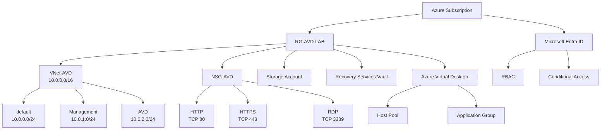

## 構成概要

Azure環境の基礎理解およびクラウドインフラ運用スキルの習得を目的として、検証環境を構築しました。

本環境では、Microsoft Entra IDによる認証・認可管理、Azure Virtual Network（VNet）によるネットワーク構成、Network Security Group（NSG）による通信制御、Azure Virtual Desktop（AVD）の構成理解、Storage AccountおよびRecovery Services Vaultを利用したデータ保管・バックアップ管理について学習しました。

また、Azure PowerShellおよびTerraformを利用し、Azureリソースの作成・管理・自動化手法についても学習を実施しました。

## 構成図

## 構築内容

### Microsoft Entra ID

Microsoft Entra IDを利用し、Azureにおける認証およびアクセス管理の仕組みを学習しました。

* ユーザーおよびグループ管理
* RBAC（ロールベースアクセス制御）
* Conditional Access（条件付きアクセス）の概念理解
* Azureリソースへのアクセス権限管理

### Azure Networking

* VNet-AVD（10.0.0.0/16）を作成
* Subnetによるネットワーク分離
* NSGによる通信制御

| Subnet     | Address Prefix | 用途                     |
| ---------- | -------------- | ---------------------- |
| default    | 10.0.0.0/24    | 既定サブネット                |
| Management | 10.0.1.0/24    | 管理用                    |
| AVD        | 10.0.2.0/24    | Azure Virtual Desktop用 |

| ポート  | プロトコル | 用途           |
| ---- | ----- | ------------ |
| 80   | TCP   | HTTP         |
| 443  | TCP   | HTTPS        |
| 3389 | TCP   | リモートデスクトップ接続 |

### Azure Virtual Desktop（AVD）

Azure Virtual Desktopの基本構成および各コンポーネントの役割について学習しました。

* Host Poolの作成
* Application Groupの作成
* Session Hostの役割を理解
* Workspaceとの関連性を理解
* ユーザー接続の仕組みを学習

### Azure Storage

Storage Accountを作成し、Azureストレージサービスの基本機能を学習しました。

* Storage Accountの作成
* Blob Storageの理解
* ストレージ冗長化方式（LRS/ZRS）の理解

### Azure Backup

Recovery Services Vaultを作成し、Azure Backupの基本構成について学習しました。

* Recovery Services Vaultの作成
* Azure Backupの構成理解
* バックアップポリシーの理解
* リストアの仕組みを学習

### Azure PowerShell

Azure PowerShell（Azモジュール）を利用し、Azureリソースの管理および情報取得を実施しました。

#### 使用コマンド

* Connect-AzAccount
* Get-AzResourceGroup
* Get-AzVirtualNetwork
* Get-AzNetworkSecurityGroup
* Get-AzVM

### Terraform

Infrastructure as Code（IaC）の学習としてTerraformを利用しました。

* Resource Groupのコード化
* VNetのコード化
* Subnetのコード化
* NSGのコード化
* terraform init / plan / apply の実行

Terraformを利用したAzureインフラ構成管理の基本的な考え方を習得しました。

### 学習成果

* Azure検証環境の構築を通じて、Microsoft Entra ID、VNet、NSG、Azure Virtual Desktop、Storage Account、Recovery Services Vaultの基本構成を学習しました。

* また、Azure PowerShellおよびTerraformを利用したリソース管理・自動化についても学習し、クラウドインフラ運用の基礎知識を習得しました。

* 今後も継続的に学習を行い、Azureを中心としたクラウド技術の理解を深めていきます。
