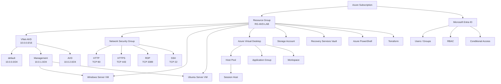

# Azure 検証環境構築

## 概要

Azure環境の基礎理解およびクラウドインフラ運用スキルの習得を目的として、検証環境を構築しました。

本環境では、Microsoft Entra IDによる認証・認可管理、Azure Virtual Network（VNet）によるネットワーク構成、Network Security Group（NSG）による通信制御、Azure Virtual Machines（Windows Server・Ubuntu）、Azure Virtual Desktop（AVD）の構成理解、Storage AccountおよびRecovery Services Vaultを利用したデータ保管・バックアップ管理について学習しました。

また、Azure PowerShellおよびTerraformを利用し、Azureリソースの作成・管理・自動化手法についても学習しました。

---

## 構成図



# 構築内容

## Microsoft Entra ID

Azureにおける認証・認可およびアクセス管理の仕組みについて学習しました。

### 学習内容

* ユーザーおよびグループ管理
* RBAC（ロールベースアクセス制御）
* Conditional Access（条件付きアクセス）の概念理解
* Azureリソースへのアクセス権限管理

---

## Azure Networking

Azureネットワークの基本構成を構築しました。

### Virtual Network

* VNet-AVD（10.0.0.0/16）を作成

### Subnet

| サブネット      | アドレスプレフィックス | 用途                     |
| ---------- | ----------- | ---------------------- |
| default    | 10.0.0.0/24 | 既定サブネット                |
| Management | 10.0.1.0/24 | 管理用                    |
| AVD        | 10.0.2.0/24 | Azure Virtual Desktop用 |

### Network Security Group

| ポート  | プロトコル | 用途           |
| ---- | ----- | ------------ |
| 80   | TCP   | HTTP         |
| 443  | TCP   | HTTPS        |
| 3389 | TCP   | リモートデスクトップ接続 |

---

## Azure Virtual Machines（VM）

Azure Virtual Machines（IaaS）を利用し、Windows ServerおよびUbuntu Serverの仮想マシンを構築しました。

### Windows Server

* Windows Server 2022 仮想マシン作成
* Standard B2ats v2（無料利用枠対象サイズ）の利用
* パブリックIPアドレスの割り当て
* NSGによるRDP（TCP/3389）の通信許可
* リモートデスクトップ接続
* 仮想マシンの開始・停止（割り当て解除）による課金管理

### Ubuntu Server

* Ubuntu Server 仮想マシン作成
* SSH（TCP/22）によるリモート接続
* Linuxサーバーへの接続方法を学習
* CUI（コマンドライン）による基本操作を理解

### 学習内容

* Azure Virtual Machines（IaaS）の基本構成
* Windows ServerとUbuntu Serverの構築
* RDPおよびSSHによるリモート接続
* NSGによる通信制御
* パブリックIPを利用した接続方式
* 仮想マシンの起動・停止と課金の仕組み

---

## Azure Virtual Desktop（AVD）

Azure Virtual Desktopの構成および各コンポーネントについて学習しました。

### 学習内容

* Host Poolの作成
* Application Groupの作成
* Session Hostの役割を理解
* Workspaceとの関連性を理解
* ユーザー接続の仕組みを学習

---

## Azure Storage

Storage Accountを作成し、Azure Storageの基本機能について学習しました。

### 学習内容

* Storage Accountの作成
* Blob Storageの理解
* ストレージ冗長化方式（LRS／ZRS）の理解

---

## Azure Backup

Recovery Services Vaultを利用し、Azure Backupについて学習しました。

### 学習内容

* Recovery Services Vaultの作成
* Azure Backupの構成理解
* バックアップポリシーの理解
* リストアの仕組みを学習

---

## Azure Cloud Shell

Azure Cloud Shell（Bash）を利用し、Azure CLIによるAzureリソースの情報取得および管理方法について学習しました。

### 学習内容

- Azure Cloud Shell（Bash）の利用
- Azure CLIによるAzureリソースの情報取得
- Azure PortalからCloud Shellを利用したリソース管理
- ブラウザ上で利用できる管理環境について理解

### 使用コマンド

```bash
az group list
az vm list -o table
az network vnet list -o table
az network nsg list -o table
```

### 学習成果

Azure Cloud Shellを利用し、ブラウザ上からAzure CLIを実行してAzureリソースの情報取得および管理方法について学習しました。


## Azure PowerShell（Azモジュール）

Azure PowerShell（Azモジュール）を利用し、PowerShellによるAzureリソースの情報取得および管理方法について学習しました。

### 学習内容

- Azure PowerShell（Azモジュール）の利用
- Azureへのサインイン
- Resource Group情報の取得
- Virtual Network情報の取得
- Network Security Group情報の取得
- Virtual Machine情報の取得

### 使用コマンド

```powershell
Connect-AzAccount
Get-AzResourceGroup
Get-AzVirtualNetwork
Get-AzNetworkSecurityGroup
Get-AzVM
```

### 学習成果

Azure PowerShellを利用し、PowerShellコマンドによるAzureリソースの情報取得および管理方法について学習しました。


## Terraform

Infrastructure as Code（IaC）の学習としてTerraformを利用しました。

### 学習内容

* Resource Groupのコード化
* VNetのコード化
* Subnetのコード化
* NSGのコード化

### 実行コマンド

```bash
terraform init
terraform plan
terraform apply
```

Terraformを利用したAzureインフラ構成管理の基本的な考え方を学習しました。

---

# 学習成果

Azure検証環境の構築を通じて、Microsoft Entra ID、Virtual Network、Network Security Group、Azure Virtual Machines、Azure Virtual Desktop、Storage Account、Recovery Services Vaultの基本構成について理解を深めました。

また、Windows ServerおよびUbuntu Serverの構築・リモート接続、Azure PowerShellおよびTerraformを利用したリソース管理・自動化を通じて、Azure IaaS環境の設計・構築・運用に関する基礎知識を習得しました。

今後は、Active Directory Domain Services（AD DS）、Azure Monitor、Azure Backup運用、Terraformによる環境構築の自動化など、より実践的なAzure運用技術について継続して学習を進めていきます。
