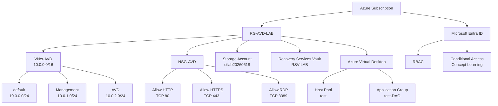

## Azure Lab Environment



## Learning Objectives

* Azure Networking (VNet / Subnet / NSG)
* Azure Virtual Desktop (AVD)
* Microsoft Entra ID
* RBAC
* Conditional Access
* Azure Storage Account
* Azure Backup (Recovery Services Vault)
* Azure PowerShell (Az Module)
* Terraform (Infrastructure as Code)

## Technologies Used

### Cloud

* Microsoft Azure

### Infrastructure

* Azure Virtual Network (VNet)
* Network Security Group (NSG)
* Azure Virtual Desktop (AVD)
* Storage Account
* Recovery Services Vault

### Identity

* Microsoft Entra ID
* RBAC
* Conditional Access

### Automation / IaC

* Azure PowerShell
* Terraform

## Key Learning Outcomes

* Azureリソースの設計・作成・管理
* VNetおよびSubnet設計
* NSGによる通信制御
* Azure Virtual Desktop構成の理解
* Azure Backup構成の理解
* Azure PowerShellによるリソース管理
* TerraformによるInfrastructure as Code実践
* Microsoft Entra IDによるアクセス制御の理解

```
```

